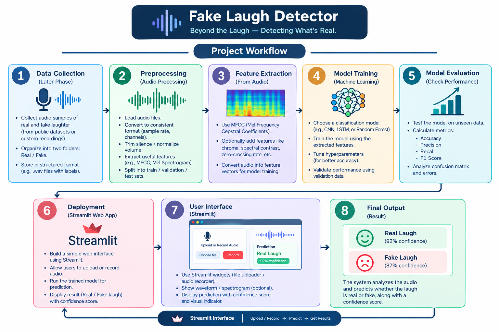

# Fake Laugh Detector 🎯

## Basic Details
### Team Name: Green Leaf

### Team Members
- Team Lead: Vaishnav PT - Jawaharlal College Of Engineering and Technology , Palakkad
- Member 2: Swaroop Krishnan M - Jawaharlal College Of Engineering and Technology , Palakkad

### Project Description
This project analyzes laughter audio to classify it as genuine (real) or posed (fake) using machine-learning techniques. It extracts acoustic features such as pitch, energy, rhythm, and MFCCs, then provides predictions through a simple web application.

### The Problem (that doesn't exist)
Determining whether someone’s laugh is a genuine burst of joy or a carefully rehearsed “ha-ha-ha” performance.

### The Solution (that nobody asked for)
We feed laughter clips to our digital Giggle Inspector, which listens for clues like pitch jumps, energy bursts, rhythm, and sound texture. Then a machine-learning model delivers its verdict: authentic belly laugh or suspiciously well-rehearsed performance.

## Technical Details
### Technologies/Components Used
For Software:
- Languages used: Python, HTML, CSS  
- Frameworks used: Streamlit  
- Libraries used: Librosa, NumPy, Pandas, Scikit-learn, SoundFile, Joblib, Matplotlib, Seaborn  
- Tools used: Git, GitHub, Visual Studio Code, Streamlit development server

### Implementation
For Software:
# Installation
git clone <your-repository-link>
cd fake_laugh_detector

python -m venv venv

.\venv\Scripts\Activate.ps1

pip install -r requirements.txt

# Run
python src\app.py

Then open the local address shown in the terminal, usually:
http://127.0.0.1:5000

### Project Documentation
For Software:

# Screenshots (Add at least 3)

*Dashboard Of Fake Laugh Detector*

*Dashboard When the Result is Published*

# Diagrams

*Workflow Diagram*

### Project Demo
# Video

*DEMO Working of The Project*

# Additional Demos
---

## Team Contributions
- Vaishnav PT : Dataset Collection
- Swaroop Krishnan M : Interface Designing

---
Made with ❤️ at TinkerHub Useless Projects 

